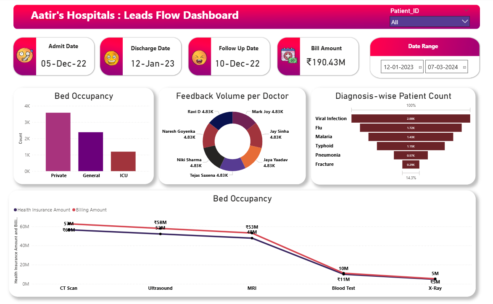

# 🏥 Hospital Analytics Dashboard | Power BI Project

## 📌 Project Overview
This project presents a comprehensive Hospital Analytics Dashboard built using Power BI.  
The dashboard provides insights into hospital billing, patient diagnosis trends, doctor feedback volume, and bed occupancy performance.

The objective of this project is to analyze operational efficiency and revenue patterns to support better healthcare decision-making.

---

## 📊 Key Metrics & Insights

- 💰 Total Billing Amount: ₹190M+
- 🛏 Bed Occupancy Analysis (Private, General, ICU)
- 🧾 Diagnosis-wise Patient Distribution
- 👨‍⚕️ Doctor Feedback Volume
- 🏥 Insurance Amount vs Billing Amount Comparison
- 📅 Interactive Date Range Filtering
- 🔎 Patient ID-based filtering

---

## 📈 Business Insights Generated

- Viral infections contribute the highest patient count.
- CT Scan and MRI generate significant revenue.
- ICU occupancy is lower compared to private and general wards.
- Insurance coverage impacts billing variations across services.

---

## 🛠 Tools & Technologies Used

- Power BI Desktop
- DAX (Data Analysis Expressions)
- Microsoft Excel (Data Cleaning & Preparation)
- Data Modeling
- Interactive Dashboard Design

---

## 📂 Project Files Included

- Power BI Dashboard (.pbix)
- Dataset (.xlsx)
- Dashboard Report (PDF)

---

## 📷 Dashboard Preview

---

## 🚀 About Me

Aatir Malek  
Aspiring Data Analyst | Business Intelligence Enthusiast  
Skilled in Excel, Power BI, Data Visualization & Business Analytics
